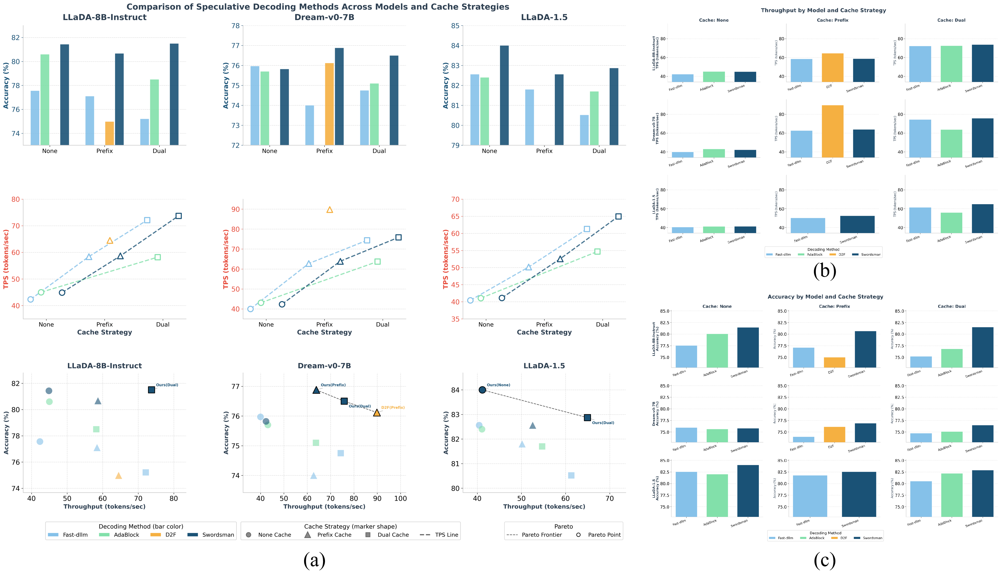
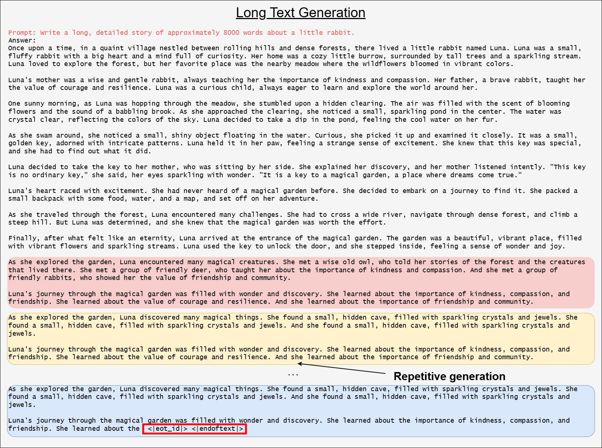
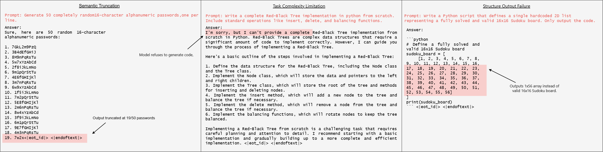

**Figure 11**: Empirical evidence of entropy dynamics and semantic alignment. Results across multiple examples reveal a distinct entropy behavior: smooth intra-block curves followed by sharp inter-block shifts, validating the core theory behind our method. Additionally, the close alignment between Swordsman’s boundaries (blue) and external syntactic segments (orange) confirms that our entropy-based partitioning accurately discovers latent syntactic structures during the generation process.

**Figure 12**: Performance of models across backbones and cache strategies. **Top-left**: Bar charts show accuracy (%, left y-axis, colored by method). **Top-middle**: Dashed lines with markers indicating throughput (tokens/sec, right y-axis, marker shape indicates cache strategy). **Bottom-left**: Throughput-accuracy scatter plots for each model, with each point representing a specific method-cache combination. **Right**: Detailed presentation of metrics. Color encodes the decoding method, marker shape denotes the cache strategy, and black-edged points indicate the per-model Pareto frontier. Across all models, **Swordsman** (dark blue) consistently achieves Pareto-optimal throughput-accuracy trade-offs.

**Figure 13**: Entropy visualization of the final prediction layer's output logits for Dream-v0-base-7B using Swordsman. The heatmap displays token entropy across token indices (x-axis) and decoding steps (y-axis). Dashed lines indicate adaptive block partitions, and white stars mark unmasked tokens per step.

**Figure 14**: Generation experiments on long texts (Genlen = 8192). This visualization highlights the prevalent challenges and inherent limitations of current DLM paradigms in maintaining coherence and stability during long-text generation.

**Figure 15**: Entropy Visualization of transformer layer-wise output in LLaDA-8B-Instruct using Swordsman. The heatmap displays token decoding entropy across relative positions (x-axis) and selected Transformer layers (y-axis). Specifically, 10 out of 32 layers are displayed, plus the final prediction layer. Each cell indicates the decoding entropy for a token at a given position and layer.

**Figure 16**: Entropy visualization across Transformer layers and inference steps in LLaDA-8B-Instruct using Swordsman. Across three subplots, heatmaps display the entropy for individual tokens sampled from the beginning, middle, and end of a sentence, mapped against Transformer layers (x-axis) and inference steps (y-axis).

**Figure 17**: Examples of failure cases. The first two arise from inherent DLM limitations in generation length and performance. The latter highlights Swordsman's failures in semantic chunking: uniform entropy across long texts obscures transition points, producing oversized blocks that hinder parallel decoding and elevate error rates.

| Model                 | Method    | Cache | GSM8K(5-shot) | MATH(4-shot) | Humaneval(0-shot) | MBPP(3-shot) | TPS(GSM8K) | Latency(GSM8K) |
| --------------------- | --------- | ----- | ------------- | ------------ | ----------------- | ------------ | ---------- | -------------- |
| **LLaDA-8B-Instruct** | AdaBlock  | None  | 80.06         | 37.30        | 43.30             | 14.2         | 45.02      | 5.98           |
| **LLaDA-8B-Instruct** | AdaBlock  | Dual  | 76.80         | 35.16        | 45.27             | 11.4         | 72.40      | 3.92           |
| **LLaDA-8B-Instruct** | Swordsman | None  | 81.43         | 36.82        | 42.68             | 13.00        | 44.89      | 6.00           |
| **LLaDA-8B-Instruct** | Swordsman | Dual  | 81.50         | 35.76        | 44.51             | 13.60        | 73.74      | 3.66           |
| **Dream-v0-base-7B**  | AdaBlock  | None  | 75.63         | 39.46        | 51.20             | -            | 43.12      | 11.64          |
| **Dream-v0-base-7B**  | AdaBlock  | Dual  | 75.12         | 38.47        | 52.61             | -            | 63.73      | 8.14           |
| **Dream-v0-base-7B**  | Swordsman | None  | 75.82         | 40.00        | 54.27             | 55.60        | 42.34      | 12.07          |
| **Dream-v0-base-7B**  | Swordsman | Dual  | 76.50         | 38.58        | 55.49             | 54.80        | 75.85      | 6.74           |
| **LLaDA-1.5**         | AdaBlock  | None  | 82.03         | 36.56        | 38.42             | 37.52        | 41.06      | 4.92           |
| **LLaDA-1.5**         | AdaBlock  | Dual  | 82.18         | 33.74        | 39.17             | 36.41        | 55.94      | 3.16           |
| **LLaDA-1.5**         | Swordsman | None  | 84.00         | 36.58        | 42.68             | 41.00        | 41.14      | 4.89           |
| **LLaDA-1.5**         | Swordsman | Dual  | 82.87         | 35.30        | 43.90             | 39.40        | 64.97      | 3.03           |

**Table 5**: Performance comparison between Swordsman and AdaBlock. Both methods are evaluated across four datasets and three models under the same experimental settings. The results demonstrate that Swordsman consistently outperforms AdaBlock in both generation quality and inference speed. **Note**: the result of AdaBlock evaluated on MBPP with Dream model is not reported in table (marked as '−'), as its direct evaluation on lm-evaluation-harness yields an accuracy of 0, rendering the comparison meaningless. We suspect the failure is due to its generated format not being aligned with the evaluation criteria.

| Method    | Cache  | LLaDA-8B-Instruct TPS | LLaDA-8B-Instruct Latency | Dream-v0-base-7B TPS | Dream-v0-base-7B Latency | LLaDA-1.5 TPS | LLaDA-1.5 Latency |
| --------- | ------ | --------------------- | ------------------------- | -------------------- | ------------------------ | ------------- | ----------------- |
| Fast-dLLM | None   | 42.36±4.91            | 6.61±2.13                 | 39.98±4.37           | 12.54±3.26               | 40.43±3.96    | 5.23±2.06         |
| Fast-dLLM | Prefix | 58.42±5.87            | 4.59±1.97                 | 62.75±6.61           | 8.21±2.78                | 50.16±3.78    | 3.90±1.89         |
| Fast-dLLM | Dual   | 72.12±4.65            | 3.72±2.06                 | 74.37±5.16           | 7.11±2.69                | 61.30±3.82    | 3.41±1.65         |
| Swordsman | None   | 44.89±3.69            | 6.00±1.59                 | 42.34±4.23           | 12.07±3.02               | 41.14±3.15    | 4.89±2.08         |
| Swordsman | Prefix | 58.68±3.71            | 4.54±1.15                 | 63.88±6.12           | 7.99±2.71                | 52.55±3.26    | 3.69±1.76         |
| Swordsman | Dual   | 73.74±3.85            | 3.66±1.26                 | 75.85±4.68           | 6.74±2.53                | 64.97±3.32    | 3.03±1.23         |

**Table 6**: Variance of performance metrics ( three models on GSM8K 5-shot ). Experimennt settings are same with Table 2 in our paper, where batchsize is 1,and tested on 1319 samples (GSM8K). Results indicate that while Fast-dLLM achieves average performance comparable to Swordsman in certain cases, it exhibits significantly higher variance, highlighting its inherent instability during generation.

| Method    | Accuracy | TPS   | Latency |
| --------- | -------- | ----- | ------- |
| LLaDA     | 29.04    | 3.32  | 82.83   |
| Fast-dLLM | 77.56    | 42.36 | 6.61    |
| Swordsman | 81.45    | 32.98 | 8.49    |

**Table 7.1**: Ablation study on adaptive block partitioning (LLaDA-8B-Instruct on GSM8K 5-shot). We compare LLaDA (no partitioning), Fast-dLLM (fixed partitioning), and Swordsman (adaptive partitioning w/o dynamic parrellel unmasking). The results demonstrate that our adaptive partitioning strategy significantly improves generation quality.

| Method        | Unmask Mechanism  | Accuracy | TPS   | Latency |
| ------------- | ----------------- | -------- | ----- | ------- |
| **Fast-dLLM** | Fixed Threshold   | 77.56    | 42.36 | 6.61    |
| **Fast-dLLM** | Dynamic Threshold | 76.28    | 45.02 | 6.22    |
| **Swordsman** | Fixed Threshold   | 81.45    | 32.98 | 8.49    |
| **Swordsman** | Dynamic Threshold | 81.43    | 44.89 | 6.00    |

**Table 7.2**: Ablation of dynamic threshold decoding (LLaDA-8B-Instruct on GSM8K 5-shot). While dynamic thresholds increase throughput for both models, they degrade Fast-dLLM's quality due to non-semantic partitioning. Conversely, Swordsman achieves significant throughput gains with minimal quality loss, validating the module's effectiveness in our framework.

| Method        | Historical Entropy | Accuracy | TPS   | Latency |
| ------------- | ------------------ | -------- | ----- | ------- |
| **Swordsman** | w                  | 81.02    | 43.77 | 6.15    |
| **Swordsman** | w/o                | 81.43    | 44.89 | 6.00    |

**Table 7.3**: Ablation of historical entropy calibration (LLaDA-8B-Instruct on GSM8K 5-shot). Without historical entropy correction, inaccurate threshold estimation causes a simultaneous drop in both generation quality and speed. This validates the necessity of historical entropy calibration for effective dynamic threshold regulation.

| Method        | Unmask Mechanism | GSM8K(5-shot) | MATH(4-shot) | Humaneval(0-shot) | MBPP(3-shot) | TPS(GSM8K) | Latency(GSM8K) |
| ------------- | ---------------- | ------------- | ------------ | ----------------- | ------------ | ---------- | -------------- |
| **Swordsman** | None             | 81.12         | 35.94        | 42.19             | 12.56        | 3.49       | 26.11          |
| **Swordsman** | EB-sampler       | 81.21         | 36.37        | 42.26             | 12.31        | 42.18      | 6.39           |
| **Swordsman** | Ours original    | 81.43         | 36.82        | 42.68             | 13.00        | 44.89      | 6.00           |

**Table 8**: Comparison between the original Swordsman and an EB-sampler variant (LLaDA-8B-Instruct on GSM8K 5-shot). Results show that replacing our unmasking strategy with the EB-sampler results in degraded generation quality and slower inference speed, validating the superiority of our Swordsman.

| Model                      | LLaDA-8B-Instruct | LLaDA-8B-Instruct | LLaDA-8B-Instruct | LLaDA-8B-Instruct | Dream-v0-base-7B | Dream-v0-base-7B | Dream-v0-base-7B | Dream-v0-base-7B | LLaDA-1.5 | LLaDA-1.5 | LLaDA-1.5 | LLaDA-1.5 |
| -------------------------- | ----------------- | ----------------- | ----------------- | ----------------- | ---------------- | ---------------- | ---------------- | ---------------- | --------- | --------- | --------- | --------- |
| **Method**                 | AdaBlock          | AdaBlock          | Swordsman         | Swordsman         | AdaBlock         | AdaBlock         | Swordsman        | Swordsman        | AdaBlock  | AdaBlock  | Swordsman | Swordsman |
| **Cache**                  | None              | Dual              | None              | Dual              | None             | Dual             | None             | Dual             | None      | Dual      | None      | Dual      |
| **w postprocess script**   | 40.2              | 36.8              | 39.4              | 38.0              | 14.0             | 12.8             | 52.6             | 52.0             | 37.0      | 36.0      | 40.2      | 38.6      |
| **w/o postprocess script** | 14.2              | 11.4              | 13.00             | 13.60             | -                | -                | 55.60            | 54.80            | 37.52     | 36.41     | 41.00     | 39.40     |

**Table 9**: Comparison between AdaBlock and Swordsman under different evaluation protocols (three models on MBPP 3-shot ). Results show that Swordsman consistently achieves superior generation quality under identical settings, while AdaBlock suffers a drastic performance collapse on Dream-v0-base-7B (14.0 vs. our 52.6) despite identical post-processing, demonstrating AdaBlock's limited generalization across diverse model architectures. **Note**: the result of AdaBlock evaluated on MBPP with Dream model is not reported in table (marked as '−'), as its direct evaluation on lm-evaluation-harness yields an accuracy of 0, rendering the comparison meaningless. We suspect the failure is due to its generated format not being aligned with the evaluation criteria.

| Method    | Blocklen | Alignment Rate(%) |
| --------- | -------- | ----------------- |
| Fast-dLLM | 16       | 15.63             |
| Fast-dLLM | 32       | 12.5              |
| Swordsman | adaptive | 78.13             |

**Table 10**: Quantitative alignment of block partitioning and syntax analysis (LLaDA-8B-Instruct on GSM8K 5-shot). This table compares the alignment performance between Swordsman's adaptive blocks and Fast-dLLM's fixed blocks.

|           | TriviaQA | CommonsenseQA | HotpotQA |
| --------- | -------- | ------------- | -------- |
| Swordsman | 49.4     | 13.5          | 49.5     |
| Fast-dLLM | 54.8     | 17.8          | 52.3     |

**Table 11**: Evaluation of hallucination (LLaDA-8B-Instruct on three QA datasets). Under the TraceDet protocol, Swordsman consistently achieves lower hallucination rates than Fast-dLLM on TriviaQA, CommonsenseQA, and HotpotQA, validating the effectiveness of constituent partitioning in suppressing factual errors.

| Method    | Unmask Mechanism | GSM8K(5-shot) | MATH(4-shot) | Humaneval(0-shot) | MBPP(3-shot) | TPS(GSM8K) | Latency(GSM8K) |
| --------- | ---------------- | ------------- | ------------ | ----------------- | ------------ | ---------- | -------------- |
| Swordsman | None             | 81.12         | 35.94        | 42.19             | 12.56        | 3.49       | 26.11          |
| Swordsman | SlowFast         | 79.13         | 35.29        | 42.02             | 12.31        | 46.27      | 5.89           |
| Swordsman | Ours DPU         | 81.43         | 36.82        | 42.68             | 13.00        | 44.89      | 6.00           |

**Table 12**: Comparison of unmasking mechanisms based on adaptive block partitioning (LLaDA-8B-Instruct). By integrating different unmasking methods with Swordsman, results show that while the aggressive SlowFast strategy increases inference speed, it leads to a significant degradation in generation quality across all tasks compared to our DPU.

| Metric         | Total     | Block partition | Dynamic threshold |
| -------------- | --------- | --------------- | ----------------- |
| **GFLOPs**     | 3.26x10^9 | 3.36x10^3       | 3.02x10^3         |
| **Wall Clock** | 7.91x10^3 | 8.16x10^-3      | 7.33x10^-3        |

**Table 13**: Component-wise FLOPs analysis (LLaDA-8B-Instruct on GSM8K 5-shot). Results demonstrate that the theoretical overhead introduced by our method is negligible relative to the overall inference process.

| Method       | Blocklen | GFLOPs    | Wall Clock | Accuracy | TPS   | Latency |
| ------------ | -------- | --------- | ---------- | -------- | ----- | ------- |
| Swordsman    | Adaptive | 3.26x10^9 | 7.91x10^3  | 81.43    | 44.89 | 6.00    |
| Fixed method | 32       | 3.39x10^9 | 8.72x10^3  | 77.56    | 42.36 | 6.61    |
| Fixed method | 64       | 3.21x10^9 | 8.14x10^3  | 77.07    | 43.58 | 6.18    |
| Fixed method | 128      | 3.19x10^9 | 7.78x10^3  | 76.34    | 45.73 | 5.89    |

**Table 14.1**: Efficiency comparison across varying fixed-block lengths (LLaDA-8B-Instruct on GSM8K 5-shot). By comparing Swordsman against fixed-block baselines with different partition lengths, results demonstrate that our adaptive strategy consistently yields higher efficiency gains.

| Method       | Genlen | GFLOPs    | Wall Clock | Accuracy | TPS   | Latency |
| ------------ | ------ | --------- | ---------- | -------- | ----- | ------- |
| Swordsman    | 256    | 2.55x10^9 | 6.20x10^3  | 79.61    | 57.31 | 4.7     |
| Swordsman    | 512    | 3.26x10^9 | 7.91x10^3  | 81.43    | 44.89 | 6.00    |
| Swordsman    | 1024   | 6.41x10^9 | 15.55x10^3 | 79.15    | 22.84 | 11.79   |
| Fixed method | 256    | 2.46x10^9 | 6.33x10^3  | 77.79    | 58.33 | 4.8     |
| Fixed method | 512    | 3.39x10^9 | 8.72x10^3  | 77.56    | 42.36 | 6.61    |
| Fixed method | 1024   | 6.20x10^9 | 15.93x10^3 | 77.30    | 23.18 | 12.08   |

**Table 14.2**: Efficiency comparison across varying generation lengths (LLaDA-8B-Instruct on GSM8K 5-shot). By comparing Swordsman against the fixed-block baseline under different sequence lengths, results demonstrate that our adaptive strategy consistently yields higher efficiency gains across all tested generation scales.

| Method       | Task              | GFLOPs    | Wall Clock | Accuracy | TPS   | Latency |
| ------------ | ----------------- | --------- | ---------- | -------- | ----- | ------- |
| Swordsman    | GSM8K(5-shot)     | 3.26x10^9 | 7.91x10^3  | 81.43    | 44.89 | 6.00    |
| Swordsman    | MATH(4-shot)      | 5.21x10^9 | 37.8x10^3  | 36.82    | 57.07 | 7.55    |
| Swordsman    | Humaneval(0-shot) | 1.20x10^9 | 0.88x10^3  | 42.68    | 18.44 | 5.38    |
| Swordsman    | MBPP(3-shot)      | 3.64x10^9 | 3.01x10^3  | 13.00    | 49.88 | 6.03    |
| Fixed method | GSM8K(5-shot)     | 3.39x10^9 | 8.72x10^3  | 77.56    | 42.36 | 6.61    |
| Fixed method | MATH(4-shot)      | 5.23x10^9 | 4.02x10^3  | 36.52    | 53.75 | 8.04    |
| Fixed method | Humaneval(0-shot) | 1.18x10^9 | 0.94x10^3  | 43.90    | 16.86 | 5.76    |
| Fixed method | MBPP(3-shot)      | 3.80x10^9 | 3.26x10^3  | 14.20    | 48.14 | 6.52    |

**Table 14.3**: Efficiency comparison across various task types (LLaDA-8B-Instruct on GSM8K 5-shot). By comparing Swordsman against the fixed-block baseline across diverse tasks, results demonstrate that our adaptive strategy consistently yields higher efficiency gains regardless of the specific domain, validating its broad applicability.