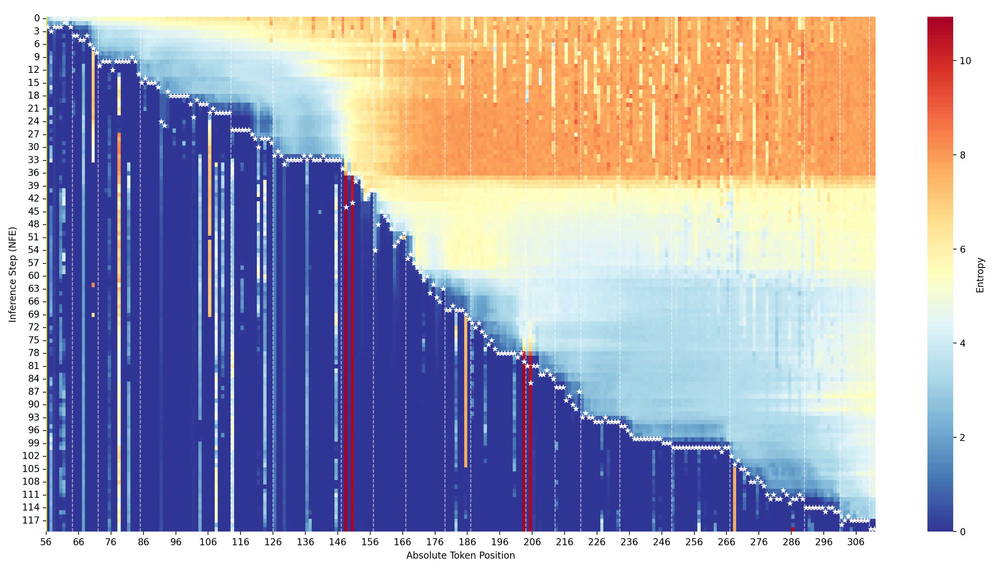
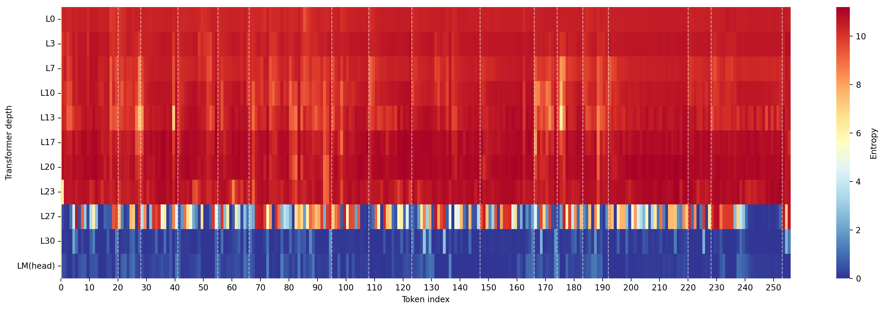
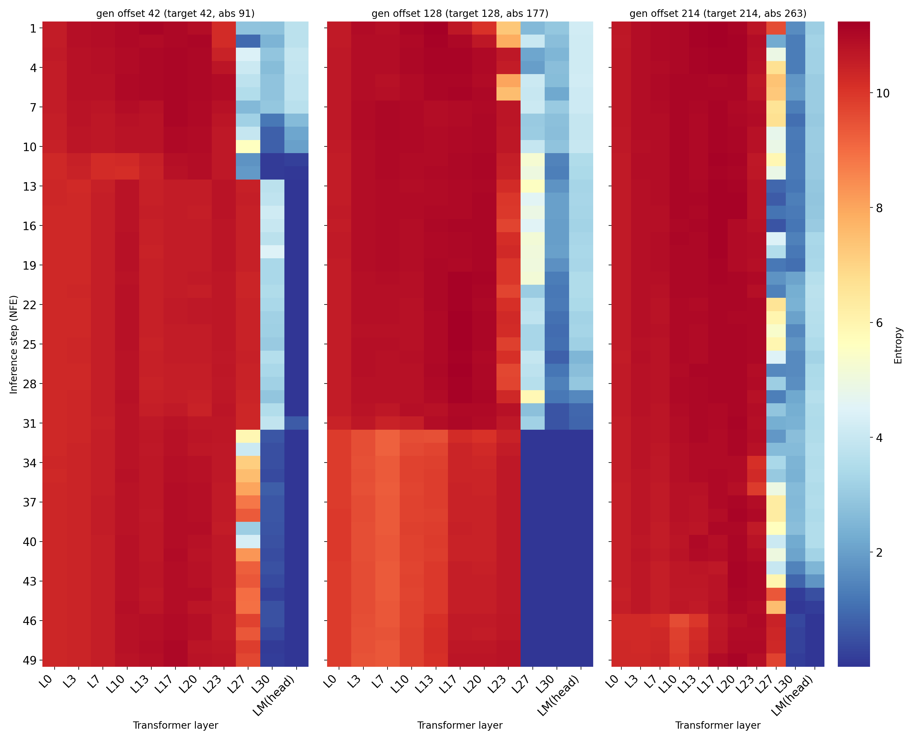

here is picture

*图11：更多语义块划分图示例。一个例子有三个子句。*

here is picture

*图12：图4的重画*

**Figure 13**: Entropy visualization of the final prediction layer's output logits for Dream-v0-base-7B using Swordsman. The heatmap displays token entropy across token indices (x-axis) and decoding steps (y-axis). Dashed lines indicate adaptive block partitions, and white stars mark unmasked tokens per step.

here is picture

*图14：长文本上的生成实验*

*图15：Swordsman在LLaDA-8B-Instruct中的transformer不同层下的熵可视化图。横坐标代表token相对位置，纵坐标代表transformer的不同层，一共有32层，我们选取了其中的10层，再加上最终的预测输出层进行展示。热力图上每一格代表该位置的token被解码时在不同层的熵值。*

*图16：Swordsman在LLaDA-8B-Instruct中的transformer不同层和推理步数下的熵可视化图。该图分为三个子图，每个子图的横坐标为transformer不同层，纵坐标代表不同的推理步数，每个子图代单个token在不同的推理下transformer各层的熵值，我们选取了位于句子前、中、后三段的各一个token来展示。*

here is picture

*图17：failure case*

| Model | Method | Cache | GSM8K(5-shot) | MATH(4-shot) | Humaneval(0-shot) | MBPP(3-shot) | TPS(GSM8K) | Latency(GSM8K) |
|---|---|---|---|---|---|---|---|---|
| **LLaDA-8B-Instruct** | AdaBlock | None | 80.06 | 37.30 | 43.30 | 14.2 | 45.02 | 5.98 |
| | | Dual | 76.80 | 35.16 | 45.27 | 11.4 | 72.40 | 3.92 |
| | Swordsman | None | 81.43 | 36.82 | 42.68 | 13.00 | 44.89 | 6.00 |
| | | Dual | 81.50 | 35.76 | 44.51 | 13.60 | 73.74 | 3.66 |
| **Dream-v0-base-7B** | AdaBlock | None | 75.63 | 39.46 | 51.20 | - | 43.12 | 11.64 |
| | | Dual | 75.12 | 38.47 | 52.61 | - | 63.73 | 8.14 |
| | Swordsman | None | 75.82 | 40.00 | 54.27 | 55.60 | 42.34 | 12.07 |
| | | Dual | 76.50 | 38.58 | 55.49 | 54.80 | 75.85 | 6.74 |
| **LLaDA-1.5** | AdaBlock | None | 82.03 | 36.56 | 38.42 | 37.52 | 41.06 | 4.92 |
| | | Dual | 82.18 | 33.74 | 39.17 | 36.41 | 55.94 | 3.16 |
| | Swordsman | None | 84.00 | 36.58 | 42.68 | 41.00 | 41.14 | 4.89 |
| | | Dual | 82.87 | 35.30 | 43.90 | 39.40 | 64.97 | 3.03 |

*表5：在相同的实验环境下，对AdaBlock对在四个数据集和三个模型上进行重新评测，并与我们的Swordsman对比展示。Swordsman的生成质量和速度全面超越AdaBlock。*

*表6：方差度量。*

| Method | Accuracy | TPS | Latency |
|---|---|---|---|
| LLaDA | 29.04 | 3.32 | 82.83 |
| Fast-dLLM | 77.56 | 42.36 | 6.61 |
| Swordsman | 81.45 | 32.98 | 8.49 |

*表7.1：在LLaDA-8B-Instruct模型和GSM8K(5-shot)数据集上进行了对自适应block划分的消融实验。比较了三种方法：LLaDA（无block划分），Fast-dLLM（固定block划分），Swordsman（自适应block划分），可以看出自适应block划分方法使得生成质量显著提升。*

| Method | Unmask Mechanism | Accuracy | TPS | Latency |
|---|---|---|---|---|
| **Fast-dLLM** | Fixed Threshold | 77.56 | 42.36 | 6.61 |
| | Dynamic Threshold | 76.28 | 45.02 | 6.22 |
| **Swordsman** | Fixed Threshold | 81.45 | 32.98 | 8.49 |
| | Dynamic Threshold | 81.43 | 44.89 | 6.00 |

*表7.2：在LLaDA-8B-Instruct模型和GSM8K(5-shot)数据集上进行了对动态阈值解码方法的消融实验，分别展示了Fast-dLLM和Swordsman使用动态和静态阈值解码的结果。动态阈值法使用到Fast-dLLM上时，虽然能使得吞吐量提升，但是由于Fast-dLLM的block的划分并非按照语义义群来做，所以与动态阈值无法很好地适配，因此造成了生成质量的些许下降。而对于Swordsman，动态阈值显著提升了吞吐量，而只产生了很小的生成质量下降，这证明了动态阈值模块于我们框架的有效性。*

| Method | Historical Entropy | Accuracy | TPS | Latency |
|---|---|---|---|---|
| **Swordsman** | w | 81.02 | 43.77 | 6.15 |
| | w/o | 81.43 | 44.89 | 6.00 |

*表7.3：在LLaDA-8B-Instruct模型和GSM8K(5-shot)数据集上进行了对是否使用历史熵来调控动态阈值的消融实验。实验结果表明在没有历史熵矫正时，对阈值的估计不准确，导致了生成质量和速度的双重下降，说明历史熵校准的必要性。*

| Method | Unmask Mechanism | GSM8K(5-shot) | MATH(4-shot) | Humaneval(0-shot) | MBPP(3-shot) | TPS(GSM8K) | Latency(GSM8K) |
|---|---|---|---|---|---|---|---|
| **Swordsman** | EB-sampler | 80.21 | 35.47 | 41.94 | 12.31 | 42.18 | 6.39 |
| | Ours original | 81.43 | 36.82 | 42.68 | 13.00 | 44.89 | 6.00 |

*表8：对比了Swordsman原本的方法和将unmask策略换成EB-sampler之后的结果，实验在LLaDA-8B-Instruct模型上进行，报告了在四个数据集的准确率，以及在GSM8K数据集上的速度指标。可见把unmask策略换成EB-sampler之后，生成质量和速度都比不上我们原本的方法。*

| Model | LLaDA-8B-Instruct |  |  |  | Dream-v0-base-7B |  |  |  | LLaDA-1.5 |  |  |  |
|---|---|---|---|---|---|---|---|---|---|---|---|---|
| **Method** | AdaBlock |  | Swordsman |  | AdaBlock |  | Swordsman |  | AdaBlock |  | Swordsman |  |
| **Cache** | None | Dual | None | Dual | None | Dual | None | Dual | None | Dual | None | Dual |
| **w postprocess script** | 40.2 | 36.8 | 39.4 | 38.0 | 14.0 | 12.8 | 52.6 | 52.0 | 37.0 | 36.0 | 40.2 | 38.6 |
| **w/o postprocess script** | 14.2 | 11.4 | 13.00 | 13.60 | - | - | 55.60 | 54.80 | 37.52 | 36.41 | 41.00 | 39.40 |

*表9：提供了在MBPP数据集上，使用Fast-dLLM原始评估协议（无后处理）与经过AdaBlock的后处理脚本评估这两种情况下的AdaBlock和Swordsman的生成表现对比，实验在三个dLLM基座模型上进行。实验结果表明，在同一评估协议下，Swordsman的生成质量要优于AdaBlock【这么写存疑】。其中比较让人疑惑的是，即使使用了相同的后处理脚本，AdaBlock在Dream-v0-base-7B上的结果（14.0）依然远低于我们的结果（52.6），处于一个比较奇怪的量级，我们只能将其认定为，AdaBlock对于模型架构的泛化性有限。*

| Method | Blocklen | Alignment Rate(%) |
|---|---|---|
| Fast-dLLM | 16 | 15.63 |
|  | 32 | 12.5 |
| Swordsman | adaptive | 78.13 |

*表10：在GSM8K(5-shot)数据集上，基于LLaDA-8B-Instruct模型，进行的block划分与语法分析结果的定量对齐实验，比较了Swordsman的自适应block和fast-dllm的固定block。*

*表11：幻觉评估*

| | Total | Block partition | Dynamic threshold |
|---|---|---|---|
| **GFLOPS** | 3.26x10^9 | 3.36x10^3 | 3.02x10^3 |
| **Wall Clock** | 7.91x10^3 | 8.16x10^-3 | 7.33x10^-3 |

*表12：基于LLaDA-8B-Instruct模型，在GSM8K(5-shot)数据集上，进行了分部分的FLOPS实际测算。*

| Method | Blocklen | GFLOPs | Wall Clock | Accuracy | TPS | Latency |
|---|---|---|---|---|---|---|
| Swordsman | Adaptive | 3.26x10^9 | 7.91x10^3 | 81.43 | 44.89 | 6.00 |
| Fixed method | 32 | 3.39x10^9 | 8.72x10^3 | 77.56 | 42.36 | 6.61 |
| | 64 | 3.21x10^9 | 8.14x10^3 | 77.07 | 43.58 | 6.18 |
| | 128 | 3.19x10^9 | 7.78x10^3 | 76.34 | 45.73 | 5.89 |

*表13.1：基于LLaDA-8B-Instruct模型，在GSM8K(5-shot)数据集上，与不同分块数量的fixed block进行了效率的比较。*

| Method | Genlen | GFLOPs | Wall Clock | Accuracy | TPS | Latency |
|---|---|---|---|---|---|---|
| Swordsman | 256 | 2.55x10^9 | 6.20x10^3 | 79.61 | 57.31 | 4.7 |
| | 512 | 3.26x10^9 | 7.91x10^3 | 81.43 | 44.89 | 6.00 |
| | 1024 | 6.41x10^9 | 15.55x10^3 | 79.15 | 22.84 | 11.79 |
| Fixed method | 256 | 2.46x10^9 | 6.33x10^3 | 77.79 | 58.33 | 4.8 |
| | 512 | 3.39x10^9 | 8.72x10^3 | 77.56 | 42.36 | 6.61 |
| | 1024 | 6.20x10^9 | 15.93x10^3 | 77.30 | 23.18 | 12.08 |

*表13.2：基于LLaDA-8B-Instruct模型，在GSM8K(5-shot)数据集上，在不同生成长度下，与fixed block进行了效率的比较。*

| Method | Task | GFLOPs | Wall Clock | Accuracy | TPS | Latency |
|---|---|---|---|---|---|---|
| Swordsman | GSM8K(5-shot) | 3.26x10^9 | 7.91x10^3 | 81.43 | 44.89 | 6.00 |
| | MATH(4-shot) | 5.21x10^9 | 37.8x10^3 | 36.82 | 57.07 | 7.55 |
| | Humaneval(0-shot) | 1.20x10^9 | 0.88x10^3 | 42.68 | 18.44 | 5.38 |
| | MBPP(3-shot) | 3.64x10^9 | 3.01x10^3 | 13.00 | 49.88 | 6.03 |
| Fixed method | GSM8K(5-shot) | 3.39x10^9 | 8.72x10^3 | 77.56 | 42.36 | 6.61 |
| | MATH(4-shot) | 5.23x10^9 | 4.02x10^3 | 36.52 | 53.75 | 8.04 |
| | Humaneval(0-shot) | 1.18x10^9 | 0.94x10^3 | 43.90 | 16.86 | 5.76 |
| | MBPP(3-shot) | 3.80x10^9 | 3.26x10^3 | 14.20 | 48.14 | 6.52 |

*表13.3：基于LLaDA-8B-Instruct模型，在不同任务类型下，与fixed block进行了效率的比较。*
